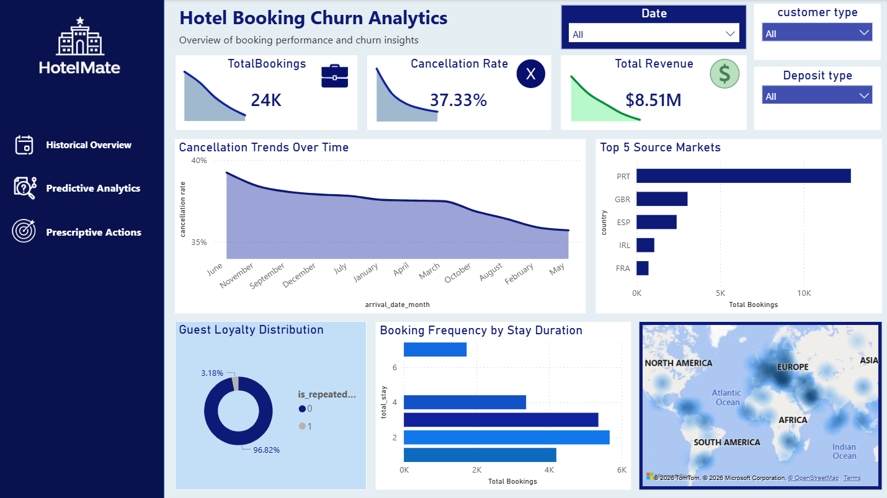
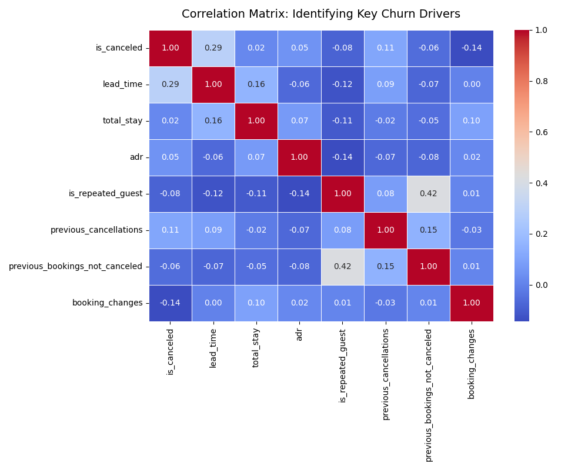
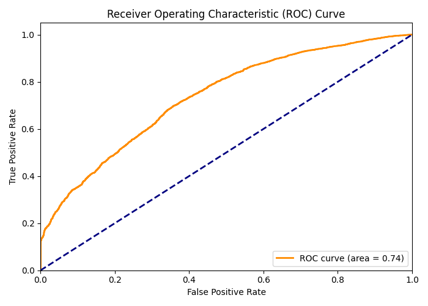

# 🏨 Travel & Hospitality: Dynamic Pricing & Retention Analytics
**Developed by: Alae Benelmekki**  
*Data Analytics Intern @ Infotact | Business Intelligence Student*

[](https://www.python.org/)
[](https://pandas.pydata.org/)
[](https://scikit-learn.org/)
[](https://powerbi.microsoft.com/)
[](https://github.com/AlaeMk)
[](https://git-scm.com/)
[](https://cmder.app/)

> **Official Internship Project Submission** – An end-to-end data analytics pipeline designed to optimize Revenue Per Available Room and minimize customer churn in the hospitality sector.

---

## Project Overview

This project addresses a critical bottleneck in the hospitality industry: **revenue leakage due to late cancellations and unoptimized room pricing**. By integrating a robust data pipeline with machine learning, this solution identifies churn drivers and provides actionable pricing strategies.

---

### 1️⃣ Executive Summary (Overview)
*Target Audience: Hotel Directors & Revenue Managers*

This dashboard provides cumulative KPIs, tracking:
- cancellation rates
- revenue leakage
- occupancy trends
- retention performance



---

### 2️⃣ Operational Deep-Dive (Predictive & Prescriptive Views)
*Target Audience: Marketing & Inventory Managers*

By applying predictive analytics to incoming reservations, the business can shift from reactive management to proactive decision-making.

| Predictive Analytics | Prescriptive Actions |
| :---: | :---: |
|  |  |

---

## ❓ Key Business Questions Answered

- What is the overall cancellation rate and associated revenue loss?
- How does `lead_time` influence cancellation probability?
- Which booking behaviors are strong indicators of churn?
- How can pricing be dynamically adjusted based on predicted demand?
- Which customer segments are considered high risk?

---

## Dataset Description

| Attribute | Description |
| :--- | :--- |
| **Domain** | Hospitality / Hotel Bookings |
| **Record Count** | ~119,390 booking transactions |
| **Target Variable** | `is_canceled` *(1 = Canceled, 0 = Retained)* |

---

##  Data Quality Issues Identified & Resolved

| Issue | Action Taken |
| :--- | :--- |
| Missing values in `company` & `agent` | Filled with `0` to represent *No Agent / No Company*. |
| Missing values in `children` | Replaced using median values and corrected data types. |
| Zero guest bookings | Removed anomalies where total guests = 0. |
| ADR outliers | Eliminated extreme ADR values caused by system/input errors. |

---

## Progress & Deliverables

| Sprint | Focus | Achievements | Status |
| :--- | :--- | :--- | :---: |
| **Week 1** | Data Acquisition & Cleaning | Cleaned datasets, handled missing values, engineered stay-duration features. | ✅ |
| **Week 2** | EDA & Statistical Analysis | Performed bivariate analysis and mapped correlations between ADR and cancellations. | ✅ |
| **Week 3** | Predictive Modeling | Built and optimized ML models using Recall & ROC-AUC metrics. | ✅ |
| **Week 4** | BI & Reporting | Finalized interactive dashboards and strategic recommendations. | ✅ |

---

##  Week 2: Statistical Analysis & EDA

During the exploratory phase, advanced statistical analyses were conducted to understand booking behaviors and cancellation trends.

###  Cancellation Correlation Matrix



####  Key Insight
Variables strongly impacting cancellation probability include:
- `lead_time`
- `deposit_type`
- `ADR`
- booking modifications

These insights guided feature engineering and predictive modeling.

---

##  Week 3: Predictive Modeling (Customer Churn)

A classification model using **Scikit-Learn** was developed to predict high-risk cancellations immediately after reservation creation.

### 📌 ROC-AUC Curve



####  Key Insight
The model demonstrates strong predictive power in distinguishing:
- retained bookings
- canceled reservations

while minimizing false positives.

---

##  Week 4: Business Insights & Strategic Recommendations

### 1️⃣ The Lead Time Phenomenon ⏳

####  Data Evidence
Customers booking several months in advance are statistically more likely to cancel.

#### ✅ Recommendation
Implement an automated communication workflow:
- personalized reminder emails
- loyalty incentives
- targeted upsells

sent:
- 60 days before arrival
- 30 days before arrival
- 14 days before arrival

to reinforce booking commitment.

---

### 2️⃣ Pricing Elasticity & ADR Optimization 💰

####  Data Evidence
Booking behavior showed high sensitivity to ADR (Average Daily Rate) fluctuations.

#### ✅ Recommendation
Adopt a dynamic pricing strategy:
- flexible pricing floors/ceilings
- non-refundable discounted offers
- demand-based price optimization

especially for customer segments identified as **High Risk**.

---

### 3️⃣ Proactive Inventory Management 🛏️

####  Data Evidence
The predictive model effectively flags churn risk before arrival dates.

#### ✅ Recommendation
Revenue managers can:
- strategically overbook
- maximize occupancy
- improve RevPAR
- reduce revenue leakage

without increasing operational risk.

---

## 📂 Repository Structure

```
customer-retention-dynamic-pricing-analysis/
├── README.md
├── .gitignore
│
├── src/
│   ├── 01_data_cleaning.ipynb
│   ├── 02_eda_and_stats.ipynb
│   └── 03_predictive_modeling.ipynb
│
├── raw/
│
├── clean_data/
│   ├── week1/
│   ├── week2/
│   │   └── cancellation_correlation_matrix.png
│   └── week3/
│       └── roc_auc_curve.png
│
└── Dashboad/
    └── views/
        ├── overview.png
        ├── predictive Analytics.png
        └── prescripive Actions.png
```


# 🛠 Tech Stack & Tools

We utilized a modern data science ecosystem to ensure scalability, reproducibility, and performance.

| Category | Tools & Languages |
|:---|:---|
| **Languages** |  |
| **Math & Data** |   |
| **Modeling** |  |
| **Development** |    |
| **Visualization** |   |

---

# 🔒 Professional Compliance & Version Control

##  Version Control

Applied semantic Git commit messaging throughout the project:

- `data-clean:` – Data cleaning and preprocessing
- `eda:` – Exploratory data analysis
- `model:` – Model development and training
- `dashboard:` – Dashboard and visualization updates

This maintains professional collaboration standards and project traceability.

---

##  Data Security

Sensitive hospitality booking data was excluded using `.gitignore` policies.

---

##  Reproducibility

All analyses were developed in **Google Colab** and documented through modular Jupyter notebooks inside the `/src` directory for complete reproducibility and auditability.

---
For questions about this project:
- **GitHub Issues**: [Open an issue](https://github.com/AlaeMk/customer-retention-dynamic-pricing-analysis/issues)
- **Email**: [alaemk13@gmail.com](mailto:alae.mk13@gmail.com)
- **LinkedIn**: [Alae Benelmekki](https://www.linkedin.com/in/alae-benelmekki/)

# 👨‍💻 Author

## Developed by **Alae Benelmekki**
**Data Analytics Intern @ Infotact**  
**Business Intelligence Student**

 **Technical Internship Project – 2026**  
✅ All 4 internship weeks successfully completed.
